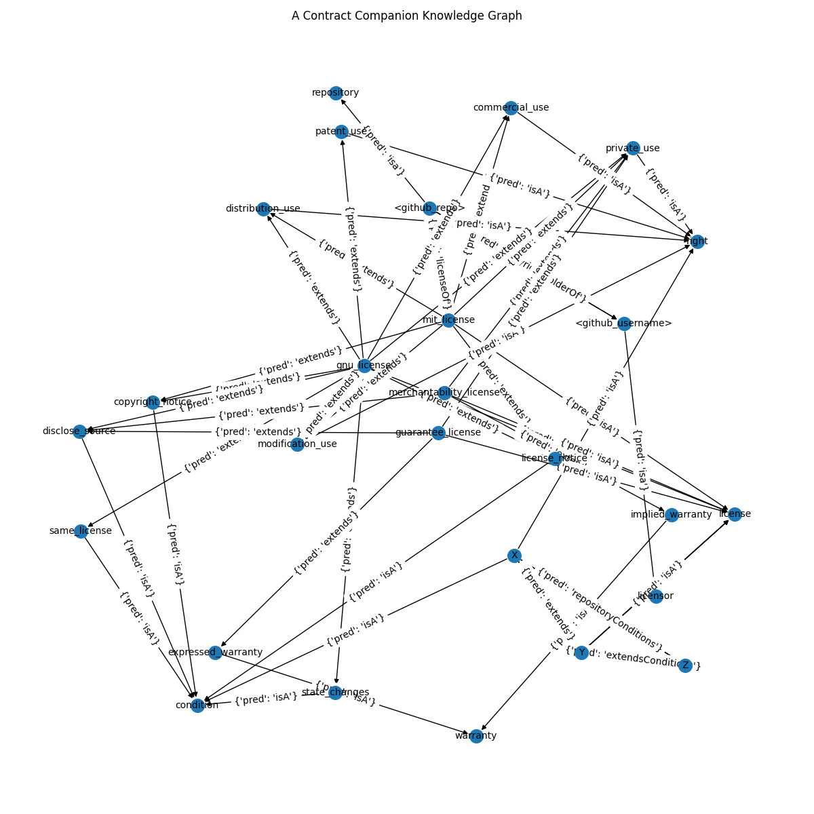

# contract-knowledge-base

A example of inference in a knowledge base with Zincbase and Graphviz.


## About

* What happens when you make a knowledge base from a set of contracts?
* In this project, we build a knowledge base of popular licenses that people use with GitHub Repositories
* The representation of each licence's goals are based on GitHub's interpretation
* This project in no way represents actual advice, just an exercise in Knowledge Representation and Reasoning

## How to Contribute

* Commits to main branch deploy directly to the app, so test before you push
* Launch a local streamlit app with *streamlit run app.py*

## The App

* Hosted on Streamlit
* App Link to [A Contract Companion](https://share.streamlit.io/msai-krr-group/contract-knowledge-base/main/app.py)

## The Code

* We leverage concepts from knowledge reasoning and representation (KRR) and apply object-oriented programming to create a microtheory of contracts. 

* Given the micro theory of facts and rules, we build queries and allow the inference engine to provide answers.  

## Misc Setup

### Zincbase

* We use Zincbase to build and maintain a knowledge base and logic engine
* Reference to GitRepo: [https://github.com/complexdb/zincbase](https://github.com/complexdb/zincbase)

### Streamlit

* We use Streamlit to deploy application code
* From terminal:

```terminal
streamlit run app.py
```

A Snapshot of the Entire Knowledge Base


